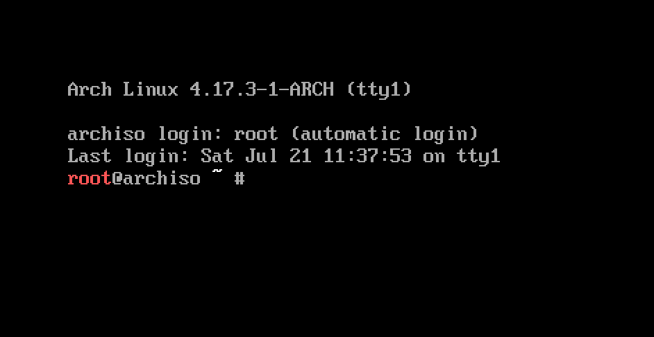
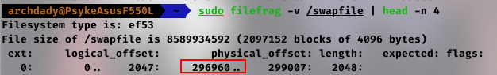
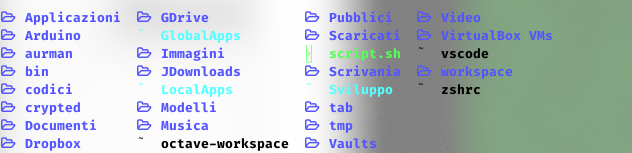

# **Guida Installazione Arch**

`versione 1.6: Talete`
 by <u>*PsykeDady*</u>

**first release** : *2019-08*

**last release** : *2020-12*


> <u>NOTE</u>:
>
> *copertina presa in prestito dal web. purtroppo ho perso il link


## **Prefazione: a chi è indirizzata questa guida?**

Questa guida si prefigge lo scopo di essere generale un po' orientata a chiunque si avvicini la prima volta nel mondo di Archlinux. Tuttavia è stata seguita seguendo le mie esigenze e le mie esperienze acquisite nel campo. Al tempo in cui sto scrivendo questa prefazione (estate 2018) ho alle spalle soli 3 anni di abilità acquisite su archlinux, installando tuttavia più e più volte la distribuzione su vari calcolatori (pc fissi, portatili, macbook etc..)

Se c'è comunque una consapevolezza di cui il tempo, le mie e le esperienze altrui mi hanno fatto dono è che, inevitabilmente, <u>**ogni calcolatore gode di un esperienza unica in termini di prestazioni, estetica e praticità della configurazione distribuzione/kernel/parametri installati da colui che si appresta ad utilizzarci GNU/Linux sopra**</u>. Questa affermazione, se pur posso assicurare abbia un alto grado di verità, tende ad entrare difficilmente nelle mentalità di chi da tempo, ormai, tende ad avere atteggiamenti da stadio anche nei confronti della più assoluta libertà che dovrebbe invece professare la community di Linux.

Inoltre consiglio a **tutti** coloro che si avventurano nella piccola impresa di installare Archlinux, di tenere sempre sottomano la guida *ultima* di tutti noi arch-user (e non solo), la [wiki](https://wiki.archlinux.org/index.php/Installation_guide): un'enorme fonte di conoscenza sul mondo linux che risolve problemi in qualsiasi ambito, o quanto meno vi aiuta a risolverli indirettamente. Tutto ciò che troverete in questa guida altro non è che un estratto di piccole sezioni della wiki che io uso sempre per installare archlinux. La guida è inoltre disponibile in moltissime lingue, tra cui l'italiano.

Ricordo inoltre che per chi volesse provare un Archlinux con installer user-friendly, esiste [Manjaro](https://manjaro.org/), una distro su base arch completamente personalizzabile al momento dell'installazione, molto ma molto user-friendly. Segnalo anche [chakra](https://www.chakralinux.org/).

Rimane comunque consigliato, a mio avviso, non scegliere Archlinux come distribuzione per approcciarsi la prima volta con il mondo GNU/Linux, ma scegliere distro più "alla mano" come **Ubuntu**, **Fedora**, **Linux Mint** o **Kde-Neon**.

Finalmente dopo un anno posso dire di aver concluso una prima *fase* di maturità di questa guida, che è stata letta, usata, commentata, criticata e corretta da tantissimi utenti. Ringrazio chiunque abbia partecipato a quella che oggi, ad Agosto 2019, ritengo essere la guida di arch versione 1.0

Detto questo: *buon divertimento e benvenuti nel fantastico mondo di Archlinux*.


*...Linux è sinonimo di libertà e rispetto...*

<pre>
Copyright (C)  Davide Galati (aka PsykeDady).
Permission is granted to copy, distribute and/or modify this document
under the terms of the GNU Free Documentation License, Version 1.3
or any later version published by the Free Software Foundation;
with no Invariant Sections, no Front-Cover Texts, and no Back-Cover Texts.
A copy of the license is included in the section entitled "GNU
Free Documentation License". 
</pre>

La versione completa della licenza si può trovare nella sezione: [Licenza per intero](##Licenza-per-intero)


### sezione speciale per versione markdown

La versione per markdown è stata scritta con il software [Typora](https://typora.io/), il tema usato per generare il pdf è *Purple*

## Indice generale

[TOC]

## preparare il supporto di installazione

Prima di iniziare, se avete dubbi sulla simbologia del documento date un occhiata all’ultima sezione di questa guida, [Template e legenda](#Template-e-legenda), che vi chiarirà cosa si intende con un determinato colore-simbolo o blocco di ciò che leggerete. Buon inizio


> **<u>ATTENZIONE</u>**:
>
> ==Non mi prendo la responsabilità di alcun danno arrecato al vostro computer o di alcun dato perso dall’uso scorretto di comandi presenti di questa guida.  I comandi sono da comprendere e interpretare anche in base alla propria configurazione.==


### Metodo 1 da Linux : dd

l primo semplice metodo consiste del preparare la pennina con il famoso tool dd :

```bash
sudo dd if=/percorso/iso of=/dev/sdX bs=4M status=progress
```

sostituire a X la lettera del mezzo di installazione, inserire la pennina e digitare `fdisk -l` e quindi leggere l’output fino ad arrivare a quella che sembra essere la vostra pennina, leggendone le coordinate.

In seguito all’installazione, per poterla nuovamente riutilizzare, dovrete azzerarla con lo stesso tool:

```bash
sudo dd if=/dev/zero of=/dev/sdXY bs=4M status=progress
```

> **<u>ATTENZIONE</u>**:
>
> ==un uso intensivo di dd potrebbe rovinare la pennina, in quanto ne sovrascrive il contenuto bit a bit. Fare quindi attenzione, meglio utilizzare pennine a basso costo e non molto capienti==

### Metodo 2 da Linux : copia su fat32 (Consigliato UEFI)

Un altro metodo consiste nel copiare il contenuto della ISO in un file system FAT32, questo metodo presenta diversi vantaggi, ma funziona solo con macchine UEFI. 

Creare quindi due directory dove montare la ISO e la USB di installazione: 

`mkdir {usb,iso}`

montare la iso utilizzando:

`sudo mount -o loop /percorso/iso iso`

se non lo si è ancora fatto, formattare la pennetta in **fat32**, supposto sia `/dev/sdX` il percorso della pennina, seguire queste istruzioni per formattarne il contenuto con fdisk (effettuare le operazioni con su o con sudo).
```bash
#da eseguire solo se si vuole completamente resettare la pennina
sudo dd if=/dev/zero of=/dev/sdX

#si entrerà in modalità fdisk, scrivere i prossimi comandi e premere invio
sudo fdisk /dev/sdX 
o
n
p
1
2048
#(invio senza scrivere nulla oppure scegliere una dimensione)
t
0b
w #si uscirà dalla modalità fdisk

sudo mkfs.fat /dev/sdX1
#sostituendo ad AAAA e MM le stesse date che trovate sulla iso
sudo dosfslabel /dev/sdX1 ARCH_AAAAMM 

sudo mount /dev/sdX1 usb
```

> *<u>SUGGERIMENTO</u>*:
> È possibile, alternativamente a fdisk, usare cfdisk, che è più user-friendly

In questo momento si ha nelle cartelle usb e iso, montati rispettivamente la usb e il contenuto della iso. Ci apprestiamo dunque a copiare il contenuto della iso nella usb
`cp -r iso/* usb`
Consiglio a questo punto di sincronizzare i buffer del disco e della pennetta e smontare le cartelle, per evitare che le modifiche non vengano effettuate correttamente:

```bash
sudo sync
sudo umount {usb,iso}
```

La pennina è pronta per i sistemi UEFI. Questo metodo è più sicuro di dd ma funziona su meno sistemi.


####  Syslinux per il boot

Eventualmente si può pensare di usare syslinux per ampliare ulteriormente il bacino di pc che vedranno la pennetta come avviabile, scaricare quindi dal proprio gestore di pacchetti l’ultima versione del software citato e di parted ed eseguire i prossimi comandi (prima di smontare la usb):

```bash
mkdir usb/boot/syslinux
extlinux --install usb/boot/syslinux
dd bs=440 conv=notrunc count=1 if=/usr/lib/syslinux/bios/mbr.bin of=/dev/sdX
parted /dev/sdX toggle 1 boot
```

> **<u>ATTENZIONE</u>**:
>
> ==quest’ultimo passo non l’ho mai applicato personalmente, ma l’ho letto sulla wiki e l’ho voluto riportare. Se qualcosa non dovesse funzionare vi invito a documentarvene personalmente sulla guida ufficiale==

### Metodo 3 da Linux : varie GUI

Se non amate molto sporcarvi le mani durante queste operazioni sono disponibili moltissimi programmi che lo fanno per voi. Personalmente (ma anche la guida ufficiale) sconsiglio fortemente l’utilizzo del noto programma *uNETbootin*, in quanto tende a funzionare solo con *Ubuntu e derivate*. Comunque sia elencherò una serie di software che ho usato io e che spesso funzionano:
- **etcher**
- **suse image writer**
- **deepin usb maker**
- **Fedora media writer**


### Altri S.O.

Su sistemi operativi OSX consiglio di usare **l’utility Disco** di sistema.

Su sistemi operativi Windows invece consiglio l’uso di **Rufus** o **LiLi** **USB** (meno consigliato su sistemi UEFI comunque). Se vi doveste trovare male con i primi, altri utenti mi hanno consigliato i seguenti programmi:

- Win32DiskImager
- USBWriter

 

## Hello world, I'm Archlinux. Nice to meet you

Supponendo ora che siate riusciti da soli ad avviare il supporto atraverso le impostazioni del vostro BIOS o le impostazioni EFI del vostro sistema o che ancora l’abbiate avviata attraverso virtualbox, possiamo passare alle prime fasi dell’installazione.

Avviando Arch, se tutto va bene, dovreste ritrovarvi davanti ad una schermata simile:



L’utente un po’ inesperto o pratico solo di installazioni Ubuntu/OSX/Windows sarà spaesato, ma nessuna paura, è tutto molto più semplice di ciò che si pensa.

Ma prima di tutto, se avete una tastiera italiana, digitate:

`loadkeys it`

se avete uno schermo hidpi digitate anche:

`setfont /usr/share/kbd/consolefonts/sun12x22.psfu.gz`

così vedrete meno madonnine volare in cielo …


> <u>NOTE</u>:
>
> nella cartella /usr/share/kbd/consolefonts/ trovate molti altri font, scegliete solo quelli 12x22 per la massima leggibilità

### preparazione del disco di installazione

 La prima cosa da fare è preparare il disco di installazione. Attraverso i comandi `blkid` o `fdisk -l` scopriamo quindi le coordinate del nostro disco ed eventualmente della partizione se preparata precedentemente attraverso altri sistemi operativi (può essere utile spesso preparare tutto attraverso una live di ubuntu con gparted se si è alle prime armi e si hanno dati da preservare).

Ci vuole comunque un po' di organizzazione, bisogna sapere in anticipo i<u>n quante partizioni</u> si vuole suddividere la propria installazione, se si è su un sistema <u>UEFI</u>, se si hanno <u>più dischi</u> e se si hanno <u>altre installazioni</u> da tenere.

La guida supporrà che il disco sia inizialmente <u>*non inizializzato*</u>, sia <u>l'unico disco</u> e che <u>non si hanno altri sistemi operativi</u> presenti. Supporrò inoltre di voler <u>suddividere l'installazione</u> in *root*, *home* e *swap*. Un altra condizione supposta sarà di avere un <u>sistema EFI</u>, con tutto ciò che ne deriva.

> <u>*Suggerimento*</u>:
>
> Lo spazio di Swap è uno spazio utilizzato dal sistema per sopperire alla mancanza di memoria RAM sufficiente a far funzionare correttamente tutti i programmi. 
> In genere si usa riservarne spazio uguale alla RAM per usufruire anche della funzione di ibernazione, che consente di spegnere il computer senza perdere la sessione di lavoro corrente (diversamente dalla sospensione non consuma batteria). Per pc con RAM maggiore di 4Gb non consiglio di usare la swap a meno di usare anche l’ibernazione, un alternativa può essere anche quella di <u>usare il file di swap anziché la partizione</u>. Maggiori informazioni si troveranno nella sezione che riguarda le configurazioni di sistema.

Si ha quindi il nostro disco su `/dev/sda`, vuoto e non inizializzato ( un disco vergine per intenderci, come quello che potremmo trovarci in una macchina virtuale). Alternativamente si può pensare di avere un disco di cui il contenuto non ci interessa, quindi le seguenti operazioni lo formatteranno completamente:

`gdisk /dev/sda`

in questo modo si entrerà nella modalità gdisk, che installerà uno schema di partizioni di tipo **GPT**, se non si ha a che fare con **UEFI** è consigliato usare `fdisk` o `cfdisk`, e avere a che fare con partizioni di tipo tradizionale, cioè **MBR**.

Esiste anche `cgdisk`, l'alternativa user-friendly di *gdisk*, prendetela in considerazioni se non volete seguire alla cieca le istruzioni qui sotto ma organizzare in maniera più pratica le partizioni secondo un' organizzazione personale.
 Dunque procediamo con la supposizione di cui sopra:

```bash
o 
n
1
(invio senza scrivere niente)
+200M
ef00

n
2
(invio senza scrivere niente)
# (sostituendo a XXX il numero di giga che volete dare alla vostra root)
+XXXG
(invio senza scrivere niente)

n
3
(invio senza scrivere niente)
# sostituendo a YYY il numero di Giga che volete dare alla home, in genere qua si mette la maggiorparte dello spazio
+YYYG
(invio senza scrivere niente) 

n 
4
(invio senza scrivere niente)
#sostituendo a ZZ il numero di Giga da dare alla swap
+ZZG
8200

w
```

dopo essere usciti dalla modalità gdisk, possiamo accertarci della situazione usando il comando `gdisk -l` oppure con `blkid`. 

Se non avete un sistema **UEFI** e volete usare `fdisk` la lista di parametri da inserire potrebbe essere questa:

```bash
n
p
1
(invio senza scrivere niente)
# sostituire a XXX il numero di giga da dare alla root
+XXXG 

n
p
2
(invio senza scrivere niente)
# sostituire a YYY il numero di giga da dare alla home, qui mettere la maggiorparte dello spazio
+YYYG

n
p
3
(invio senza scrivere niente)
# sostituire a ZZ il numero di Giga da dare alla swap
+ZZG

t
3
82
```

<u>Ricordate comunque di controllare il significato delle opzioni tramite gli appositi help interattivi</u>. Per usare le partizioni è comunque necessario formattarle, ritorniamo nella supposizione in cui siate UEFI:

```bash
mkfs.fat /dev/sda1
mkfs.ext4 -m 0 /dev/sda2
mkfs.ext4 -m 0 /dev/sda3
mkswap /dev/sda4
```

Altrimenti avrete una cosa simile:

```bash
mkfs.ext4 -m 0 /dev/sda1
mkfs.ext4 -m 0 /dev/sda2
mkswap /dev/sda3
```

> *<u>SUGGERIMENTO</u>*:
> Potreste voler identificare i vostri hard disk con un etichetta, tipo ‘Arch-Root’ o simili. In caso potreste utilizzare il comando `e2label` :
>
> - `e2label /dev/sda1 ‘ArchRoot`
>
> Attenti perché ogni file system ha il suo software per creare label. Ad esempio la swap usa `swaplabel`. 

**Dunque** possiamo iniziare a montarle:

```bash
mount /dev/sda2 /mnt
mkdir -p /mnt/boot/efi
mkdir /mnt/home
mount /dev/sda1 /mnt/boot/efi
mount /dev/sda3 /mnt/home
swapon /dev/sda4
```

oppure (Non UEFI):

```bash
mount /dev/sda1 /mnt
mkdir /mnt/home
mount /dev/sda2 /mnt/home
swapon /dev/sda3
```

La sezione riguardante la configurazione dei dischi finisce qua.

### Installazione dei pacchetti e connessione al mondo esterno

Stop. Senza internet non si va da nessuna parte.

Se quindi siete connessi via cavo, basta dare `dhcpcd`, altrimenti la procedura richiede qualche passaggio in più. Innanzitutto apriamo l'interfaccia interattiva:

`iwctl`
Poi individuiamo l'interfaccia di rete wireless:

`device list`

Qui, sotto la voce **name**, dovrebbe apparire la vostra interfaccia di rete, se non compare nulla potreste aver bisogno di driver particolari per connettervi, in tal caso usate trovate un ethernet o usate il tethering usb del telefono fino a fine installazione.

Supponiamo la vostra interfaccia si chiami **wlan0**, procedete quindi con lo scan delle reti circostanti:

```bash
station wlan0 scan
station wlan0 get-networks
```

Dovremmo avere la lista delle reti visibili dal nostro pc. Quindi connettiamoci a quella di nostra preferenza:

`station wlan0 connect NOME-RETE`

Ci sarà chiesto di inserire la password. Potete quindi utilizzare la scorciatoia `Ctrl+d` per uscire (oppure digitare `exit` quindi invio) 


Date `dhcpcd` per forzare il router a rilasciarvi un indirizzo ip. Ben fatto, siete connessi! Sicuri? per accertarcene possiamo dare 

`ping -c 3 www.google.com`

Se tutto va bene, vi risponderà che sono stati trasmessi e ricevuti 3 pacchetti. Ora che siamo sicuri possiamo andare avanti.

Arch offre un modo davvero comodo per scaricare i pacchetti d'avvio sulla nostra nuova installazione, attraverso **pacstrap**:

`pacstrap /mnt base base-devel linux linux-firmware net-tools dialog iwd netctl wpa_supplicant grub efibootmgr dhcpcd`

Poi dobbiamo installare anche un editor di testo, per **nano** possiamo usare:

`pacstrap /mnt nano`


se tutto va per il meglio (spero per voi) il vostro */mnt* sarà adesso abbastanza popolato.


### prime configurazioni

Creiamo quindi il vostro fstab che permetterà di montare le cartelle nel giusto ordine all'avvio:

`genfstab -pU /mnt >> /mnt/etc/fstab`

ed entriamo quindi in chroot attraverso un comodissimo script arch:

`arch-chroot /mnt`

settiamo la password di root con `passwd` e <u>modifichiamo il file fstab</u> (con `nano`, `vi` o qualunque altro editor ci piace usare) creato in precedenza sostituendo nella riga della swap il parametro *none* con la dicitura **swap**.
Supponendo che stiate usando **nano**, potete digitare:

`nano /etc/fstab`

fare la modifica al file e poi **ctrl-x** per uscire (**y** e poi **enter** per salvare il file).

Configuriamo quindi il grub:

`grub-install /dev/sda`

`grub-mkconfig -o /boot/grub/grub.cfg`

si può quindi dare un nome alla macchina in rete:

`echo "<NOMEPC>" > /etc/hostname`

Si può ora impostare la lingua: andando ad editare il file */etc/locale.gen* decommentando (togliendo il carattere ***#***) le tre linee che iniziano con **it_IT**, poi diamo il comando `locale-gen` per generare i file della lingua. Se volessimo altre lingue, basta decommentare la riga corrispondente al codice della lingua desiderata, ad esempio per l’inglese decommentiamo quelle con **en**

In seguito bisogna generare un buon */etc/locale.conf*, usiamo il nostro editor preferito e scriviamo all'interno:

```bash
LANG=it_IT.UTF-8
LC_COLLATE="C"
LC_TIME="it_IT.UTF-8"
LANGUAGE="it_IT:en_EN:en"
```

impostiamo la lingua del tty con:
`echo "KEYMAP=it" > /etc/vconsole.conf`

e impostiamo il fuso orario di sistema con:
`ln -sf /usr/share/zoneinfo/Europe/Rome /etc/localtime`

### programma di installazione terminato
Il sistema è installato correttamente, adesso andiamo a smontare le partizioni:

```bash
exit
umount /mnt/boot/efi
umount /mnt/home
umount /mnt 
swapoff
sync
poweroff # o reboot se volete riavviare
```
possiamo quindi riavviare e continuare le configurazioni tramite l'utente root e non in ambiente di chroot


## Configurazioni di sistema
Dopo aver riavviato e tolto la chiavetta dovremmo essere davanti la schermata di selezione dei sistemi del grub, dove la prima opzione dovrebbe proprio corrispondere a quella di avviare archlinux. Se così non fosse, reinserite la chiavetta, rimontate le partizioni e rifate il chroot, cercando la soluzione al problema usando anche la wiki. Da qui in poi sarà supposto che voi abbiate il sistema funzionante e possiate are il login tramite account di root.
E quindi inserite come nome utente proprio root e come password quella impostata precedentemente. È quindi tempo di fare un po' di configurazioni a sistema appena installato.

### Connettiamoci al mondo esterno e alcuni consigli iniziali

Come sempre la prima cosa da fare è connettersi, esattamente come prima possiamo usare `dhcpcd` e nel caso della rete senza fili possiamo procedere come prima con `iwctl` oppure utilizzare il tool  `wifi-menu`, che potreste preferire per l'immediatezza (è una comoda interfaccia grafica molto intuitiva).
Nel caso di iwctl, ricordiamo di dare prima:  
`systemctl start iwd`

Il primo consiglio che innanzitutto do è quello di eseguire subito un upgrade del sistema e dei repository:

`pacman -Syyu`

Consiglio poi di installare alcuni pacchetti che nel 90% dei casi vi saranno utili

`pacman -S linux-headers os-prober git bash-completion man-db man-pages`

Nello specifico:

- **linux-headers** sono una serie di interfacce che servono a compilare alcuni pacchetti, capirete a cosa vi serve quando arriveremo ai repository AUR
- **os-prober** serve a rilevare altri sistemi operativi all'avvio, digitate quindi `grub-mkconfig -o /boot/grub/grub.cfg` per aggiornare il grub
- **git** è un sistema di versioning di file e cartelle, usatissimo in ambito di programmazione e vi servirà per scaricare il codice da repository remoto
- **bash-completion** serve ad abilitare l'autocompletamento con tab nella famosissima shell bash
- **man-db** e **man-pages** si occuperanno di generare e farci consultare le documentazioni tramite il noto comando  `man <comando>`. Il comando in questione deve essere provvisto comunque di documentazione


### Server e driver

n ambienti linux, senza motore grafico, si può usare il pc al più come server. Oggi giorno la produttività dipende strettamente da ciò che si vede e come ci si può interagire. Per questo motivo verrà illustrato come installare il server grafico **XORG**. Esistono oggi alternative valide, ma rimane questo tuttavia il server più stabile e consolidato nel mondo del pinguino. È quindi consigliabile comunque installarlo a prescindere da ciò che vorrete provare in futuro.

Insieme al server grafico si consiglia di installare il suo sistema di init, che nel caso in cui un D.M. (la grafica di accesso al sistema) non funzioni a dovere sarà un ottimo sostituto. Quindi:

`pacman -S xorg-server xorg-xinit`

Potete impostare nel file *~/xinitrc* il comando per utilizzare il vostro DE preferito (quando ne avrete uno). 
Installare i driver video è anche abbastanza semplice.


####  su Virtualbox 

`pacman -S virtualbox-guest-utils`


#### su VMWare 

```bash
pacman -Sy net-tools gtkmm3 open-vm-tools xf86-video-vmware xf86-input-vmmouse 

systemctl enable vmtoolssd.service
```


### Altri casi 

Andiamo ad identificare la scheda video con **lspci**:

`lspci | grep VGA`

l'output riporterà al suo interno: *intel*, *ati* o *nvidia*. In base a cosa riporta andiamo ad installare i driver *open* relativi:

```bash
#per installare i driver intel
pacman -S mesa

#per installare i driver ati
pacman -S xf86-video-amdgpu

#per installare i driver nvidia
pacman -S xf86-video-nouveau
```


per installare i driver proprietari vi invito invece a visitare la wiki relativa.

> *<u>SUGGERIMENTO</u>*:
> [Leggete la guida di arch](https://wiki.archlinux.org/index.php/Intel_graphics) e la sezione relativa alla vostra GPU sempre. Contiene consigli utili.
> Ad esempio: per le <u>Intel Graphics</u> dal 2006 in poi è consigliato installare solo mesa, per quelle precedenti il pacchetto `xf86-video-intel`. Inoltre  consiglia di abilitare i repo 32bit e installare `lib32-mesa` e per le vulkan (intel gpu ivy bridges a seguire) il pacchetto `vulkan-intel`.


Per il touchpad installiamo il driver libinput:

`pacman -S xf86-input-libinput`

> *<u>SUGGERIMENTO</u>*:
> Alcune volte può essere necessario installare i vecchi driver synaptics per il touchpad, installali solo in caso di problemi con libinput:
> `pacman -S xf86-input-synaptics`


### Dual boot con Windows

Se avete il dual boot con Windows è probabile ci sarà tra un sistema e l’altro uno scarto di tempo di due ore, questo perché Windows non usa il tempo universale ma il locale. 
Se non volete quindi modificare il comportamento di windows (la wiki di arch spiega molto bene come fare nel caso) potete modificare invece il comportamento di Archlinux 

`timedatectl set-local-rtc 1 --adjust-system-clock`

> <u>NOTE</u>:
>
> La saggia wiki in realtà consiglia di cambiare il comportamento di windows, e non di archlinux.  Per  farlo dovrebbe essere necessario dare questo da prompt di comandi (di Windows):
> `Reg add HKLM\SYSTEM\CurrentControlSet\Control\TimeZoneInformation /v RealTimeIsUniversal /t REG_QWORD /d 1` 

noltre sicuramente si vuole essere in grado di leggere le partizioni create da windows, allo scopo possiamo pensare di installare **ntfs-3g** 
`sudo pacman -S ntfs-3g`

> **<u>ATTENZIONE</u>**:
>
> ==Il dual boot con windows è problematico se tenete attivo il fast boot, in particolare potreste essere non più in grado di montare la sua partizione. E <u>sconsiglio fortemente</u> di usare `ntfs-fix` per sbloccare manualmente il disco.
Disattivate quindi il fast-boot se avete intenzione di leggere e scrivere sulla partizione di win==

### Aggiunta utente, creazione cartelle utente e cifratura home

È sempre bene utilizzare l'account root solo se strettamente necessario, altrimenti è meglio impostare un utente amministratore o semplice (ancora meglio).

Per aggiunte di un utente amministratore digitare:

`useradd -m -g users -G wheel,video,audio,sys,lp,storage,scanner,games,network,disk,input -s /bin/bash <nome utente>`

per un utente non amministratore basta eliminare il gruppo **wheel** dal comando precedente.

Impostiamo quindi una password per l'utente appena creato:

`passwd <nome utente>`

e indichiamo al programma sudo ( che ci permette di effettuare operazioni in modalità amministratore) che il nostro utente fa parte del gruppo amministratore, questo tramite visudo:

```bash
#impostiamo prima un editor di testo a noi più amichevole, di default è vi
export EDITOR=<nome editor>
visudo
```

a questo punto esistono due modi di impostare i permessi di amministratore: con richiesta della password (consigliato) e senza richiesta.

Nel primo caso decommentare la riga:

`wheel ALL=(ALL) ALL`

nel secondo caso decommentare:

`wheel ALL=(ALL) NOPASSWD: ALL`

A questo punto configuriamo le cartelle utente, installiamo
`pacman -S xdg-user-dirs`
Al nostro primo accesso con l'utente ricordiamoci di dare :
`xdg-user-dirs-update`
Se vogliamo possiamo accedere subito scrivendo `su <nome utente>`


> <u>NOTE</u>:
>
> Ricordati che puoi cambiare il nome delle cartelle di base (Immagini, Video ...etc) modificando il corrispettivo in `/home/<nome utente>/.config/user-dirs.dirs` inserendo ad uno ad uno i nomi che desideriamo sostituire.
>
> I nomi predefiniti dovrebbero essere quelli della lingua impostata

___

> **<u>ATTENZIONE</u>**:
>
> ==Il prossimo step è opzionale, fatto in fretta o male potrebbe farvi perdere dati, potreste dover riprendere la live per aggiustare le cose o reinstallare se non siete in grado. Quindi procedete con cautela e se lo ritenete un passo fondamentale. 
Inoltre vorrei portarvi a conoscenza del fatto che questo metodo renderà la vostra home incompatibile con il client dropbox se lo usate, quindi dovrete installare dropbox in una cartella diversa da quella proposta.==

Potete decidere di cifrare il contenuto della vostra home, un po’ come succede nei telefoni che possiedono metodi di sblocco biometrici. Per farlo la prima cosa è installare alcuni pacchetti:

`pacman -S ecryptfs-utils keyutils rsync lsof`

Quindi caricate l’apposito modulo del kernel

`modprobe ecryptfs`

Potrebbe essere necessario apportare una modifica al file /etc/mkinitcpio.conf e scrivere all’interno della sezione **MODULES** il nome del modulo per forzarne il caricamento ad ogni avvio del pc. Successivamente ricompilate il servizio di avvio

`mkinitcpio -p linux`

Usare quindi il tool per la migrazione della home, per avviare questa fase è necessario che voi non abbiate alcun processo aperto con l’utente di cui cifrare la home:

`ecryptfs-migrate-home -u <nome utente>`

Seguire le istruzioni indicate. Per completare la procedura, uscite dal vostro account root con `exit` ed entrate con quello dell’utente. Verificate quindi con `ls` che siano state criptate tutte le cartelle ( dovrebbe apparire Access-your-data.desktop e un altro file di testo)
Quindi decriptate e ri-criptate voi stessi la home usando i due tool

```bash
ecryptfs-mount-private #per decriptare
ecryptfs-umount-private #per criptare
```

Potete usare i due comandi ogni volta che volete cifrare o decifrare la cartella home manualmente, può accadere alla volta che la cifratura non avvenga per processi aperti du file all’interno della home, si può quindi forzare il procedimento con questo comando

`umount.ecryptfs_private`

uscite dall’account user (dopo aver smontato la cartella) e rientrate con root per maggiore comodità.


Ora è necessario (a meno che non vogliate fare l’accesso a mano ogni volta) impostare l’automounting della home già decriptata all’accesso. Facciamo un backup del file `/etc/pam.d/system-auth` :

`cp /etc/pam.d/system-auth /etc/pam.d/system-auth.old`

ed editiamo quindi il file `system-auth` con il nostro editor preferito

`<editor> /etc/pam.d/system-auth`

Da adesso facciamo MOLTA attenzione, sbagliando qualunque cosa potremmo non essere più in grado di accedere a nessun account ( dovremmo quindi aggiustare le cose in chroot dalla iso di arch). 


Andiamo quindi ad aggiungere dopo la stringa che contiene **auth [default=die] pam_faillock.so authfail** la seguente linea:

`auth required pam_ecryptfs.so unwrap`

Prima della linea che contiene **password required pam_unix.so** aggiungiamo:

`password optional pam_ecryptfs.so`

E infine dopo la linea che contiene **session required pam_unix.so** aggiungiamo:

`session required pam_ecryptfs.so unwrap`

Usciamo dall’editor salvando. Per essere sicuri di aver fatto le cose a modo apriamo un altro tty ( `ctrl-alt-f2` ) e facciamo l’accesso con l’utente. Se l’accesso avviene correttamente, e se la cartella viene corretemente decriptata, allora è tutto ok. Eliminate la cartella backup (ha il suffisso del vostro nome, ed un numero accanto), cercatela con 
`ls /home/` 
Eliminatela con:
`sudo rm -rf nomeutente.NUMERO` 


Altrimenti ritornate immediatamente nel primo tty ( `ctrl-alt-f1` ) e correggete l’errore nel file o, nel caso non riusciate, eliminate le modifiche e riprendete il file di backup:

`mv -f /etc/pam.d/system-auth.old /etc/pam.d/system-auth` 

E ricopiate anche la cartella di backup, fornita da ecryptfs

```bash
sudo rm /home/nomeutente
sudo mv /home/nomeutente.numero /home/nomeutente
sudo rm -rf /home/.ecryptfs
```


Se tutto è andato a buon fine ricordate di far uscire con `exit` l’utente. Se la cartella non viene ricriptata potreste avere problemi di accesso d’ora in poi, nel caso entrate con un tty diverso e ricriptatela da virtual console con i comandi di umount, ripassate quindi al tty principale per continuare l’accesso.

### configurare pacman

Perché archlinux? perchè complicarsi la vita con questa tortura che ti porta a perdere una giornata per l'installazione di un sistema operativo? Le risposte sono tante, ma la prima in assoluto è il gestore di pacchetti **pacman** e tutto ciò che ne deriva, compreso il famoso **AUR: Arch User Repository**.

Prima di tutto abbelliamo il nostro gestore! 
 Sempre con il nostro editor preferito *( a proposito, il mio è `nano`, vi insegnerò anche a renderlo carino)* modifichiamo il file `/etc/pacman.conf`: andiamo a decommentare la riga con scritto **Color** e aggiungiamo sotto **ILoveCandy**. Poi decommentiamo dove c’è scritto **[multilib]** e la riga di sotto se vogliamo abilitare il supporto alle librerie a 32 bit (necessario per alcuni programmi). Ogni volta che aggiungete un repository ricordate di dare:

`pacman -Sy`

Se volessimo aggiungere un nuovo repository lo possiamo fare seguendo il template alla fine del file, da difficilmente ne avrete bisogno dopo che installerete un **aur-helper**

### Un AUR-che?

Un AUR-helper cerca per voi e aggiorna (o segnala aggiornamenti) di pacchetti su AUR. Ne esistono diversi tipi, da quelli più semplici che fanno solo la ricerca a quelli più complessi che cercano, gestiscono e aggiornano i pacchetti e anche il sistema al posto di **pacman**. Quest’ultimi son detti anche **pacman-wrapper** ed usano la stessa sintassi di **pacman** in genere. 

Supponiamo di volerne installare uno di nome `<nomeaurhelper>` e di cui abbiamo il link del repository ( che si può facilmente trovare con una ricerca su internet). Generalmente si installa così:

```bash
git clone https://aur.archlinux.org/<nomeaurhelper>.git
cd <nomeaurhelper>
makepkg -si
```

#### Consigli ed esempi

Attualmente le alternative che mi sento di consigliare sono:

- yay (scritta in go)
- paru ( scritta in rust, evoluzione di yay)

Ne si può trovare una tabella descrittiva [a questa pagina](https://wiki.archlinux.org/index.php/AUR_helpers)  

Installiamone quindi uno: **yay** ! Per lo step successivo è <u>**fortemente consigliato**</u> l'accesso con l'utente e <u>non con root</u>.

```bash
git clone https://aur.archlinux.org/yay.git
cd yay
makepkg -si
```

> <u>NOTE</u>:
> Per installare **paru**,  scriverlo quindi al posto di yay.  


D'ora in poi potete sostituirlo in tutto e per tutto al package manager, l'unica differenza sta nel fatto che cerca i pacchetti anche su **AUR**, questo <u>immenso repository di pacchetti</u> offerti dalla comunità di Archlinux, ci trovate davvero di tutto dentro (*perciò fate comunque attenzione*).

> <u>NOTE</u>:
>
>  yay, così come la maggior parte degli AUR-helper, non vanno usati come utenti privilegiati (con **sudo** o **l’account root** per intenderci)

Tramite yay potete visualizzare la differenza tra versione presente e quella aggiornata del software, oppure visionare e modificare il **PKGBUILD** (una sorta di file che contiene le istruzioni di compilazione del pacchetto, con dipendenze, siti da dove scaricare i binari ed eventualmente potete anche selezionare delle opzioni), questo lo rende uno strumento molto potente!

> <u>NOTE</u>:
>
> Altri AUR-helper interessanti li trovate nella guida, perciò se per un motivo o per l’altro quello segnalato in guida non dovesse funzionare, vi invito a visitarne la pagina con la lista 

### tmp file system

Nel nostro file system una cartella speciale, */tmp*, contiene file e cartelle temporaneamente creati dai programmi per il loro corretto funzionamento. Questa cartella viene montata da systemd automaticamente in memoria **RAM** in modo da essere svuotata ogni qual volta il calcolatore viene spento.

È comunque possibile, per quei pc che non hanno un gran quantitativo di memoria disponibile, montare la cartella nello spazio di archiviazione piuttosto.

> *<u>SUGGERIMENTO</u>*:
> Se installate frequentemente programmi da AUR con un AUR-helper è possibile che quest’ultimo, facendo tante scritture su /tmp, vi saturi facilmente la memoria. Consiglio particolarmente questo procedimento ai pc con meno di 8GB di RAM che installeranno quindi molti pacchetti da AUR

Per disabilitare il montaggio automatico basta dare:

`sudo systemctl mask tmp.mount`

Bisogna comunque tener conto che disabilitando questo comportamento, il contenuto della cartella dei file temporanei non verrà più cancellato allo spegnimento del dispositivo, va quindi eliminato manualmente.
Si può tornare al comportamento di default specificando manualmente il montaggio in `/etc/fstab`, aggiungendo questa riga al file:

`tmpfs /tmp tmpfs nodev,nosuid 0 0`

Si può anche specificare una size massima per evitare che la ram venga monopolizzata dalla sola partizione di file temporanei, facendo un esempio con il limite di 2GB avremmo:

`tmpfs /tmp tmpfs nodev,nosuid,size=2G 0 0`

Altre interessanti informazioni su **tmpfs** si trovano sulla guida di arch.


### Swappiness

e avete installato un area di swap la vostra maggior paura sarà quella che il vostro pc possa usarla senza che ce ne sia la reale necessità; non è infatti detto che il sistema operativo debba aspettare di riempire la RAM prima di usare la SWAP.

In ogni caso questo aspetto del sistema si può benissimo controllare atraverso la swappiness, impostandola in modo permanente o temporaneo.

Per farlo in maniera definitiva possiamo modificare il file */etc/sysctl.d/99-sysctl.conf*

`vm.swappiness=1`

Come funziona questo valore però? Perché **1** e non **0**?

Il valore di swappiness va da 0 a 100 e **<u>indica il valore di ram in percentuale che si desidera tenere libero prima di attivare la zona di swap</u>**. Ad esempio normalmente il valore di swappiness è *60*, questo significa che oltre il *40% di ram occupata*, *la swap si attiva* (non finisce tutto in swap ovviamente, ma il sistema tende ad assestarsi su quel valore di RAM libera). Nelle versioni antecedenti a *linux 3.5*, un valore di swappiness **0** significava *“usa la swap solo in caso di stretta necessità”*, oggi ne disattiva invece le funzioni.
 Maggiori informazioni [qui](https://www.kernel.org/doc/Documentation/sysctl/vm.txt) e [qui](https://en.wikipedia.org/wiki/Paging#Swappiness).

La fase iniziale di configurazione è finita, consiglio prima di proseguire un riavvio del sistema.


### swap file

Potrebbe essere più comodo in alcuni casi avere un file di swap anzichè la partizione, un po’ come fanno windows e mac.

In tal caso dovreste prima creare il file in questione:

`sudo dd if=/dev/zero of=/swapfile bs=1M count=XXX status=progress`

al posto di XXX inserite il quantitativo di megabyte che volete impostare, ad esempio per una ram di 2G potete impostare `count=2000`.

Rendiamola a tutti gli effetti una swap tramite:

`sudo mkswap /swapfile`

Impostiamo i permessi giusti al file:
`sudo chmod 600 /swapfile`

e vediamo se va tutto bene attivandola
`sudo swapon /swapfile`

Se avete messo la partizione di swap potete disattivarla così 
`sudo swapoff /dev/sdXY # sostituendo le coordinate`

Se tutto è ok, possiamo anche pensare di abilitare il file di swap all’avvio insieme al montaggio dei dischi.
Apriamo con un editor di testo il seguente file:
`sudo nano /etc/fstab`

e scriviamo una riga così:
`/swapfile 	swap 	swap	 defaults 	0 0`


ora possiamo testare se abbiamo scritto bene il file. Prima di tutto disattiviamo la swap on `swapoff` se è attiva.

Per testare se la configurazione è corretta, scolleghiamo con `swapoff` lo swapfile e poi digitiamo:

`sudo swapon -a`

Questo comando abiliterà tutte le swap presenti in */etc/fstab*. Si, se vi state chiedendo perché io abbia detto “*le swap*”, la risposta è che potete tenere anche più file di swap o più partizioni.


### Quando Tux congela: ibernazione

Prima di tutto bisogna capire cos’è l’ibernazione, magari molti non lo sanno. Quando un sistema operativo entra in questo stato, la memoria con tanto di processi attivi vengono salvati nell’area di swap e il pc si spegne. Al riavvio, sarà come se avessimo sospeso il pc, ma non è stata consumata batteria (potete anche staccare l’alimentazione).

I prerequisiti per un ibernazione corretta sono quindi legati alla swap: dovete averla attiva e funzionante, la parte di swap libera deve quantomeno eguagliare la memoria RAM utilizzata, in modo da poter ibernare senza complicazioni. Consiglio quindi di utilizzare una swappiness moto bassa, così da avere la swap tendente al vuoto.

Avendo questi prerequisiti, come si fa ad ibernare su Arch? I passi da effettuare sono principalmente questi:

Segnamoci innanzitutto l’UUID della partizione tramite il comando `blkid`. Se usiamo un file di ibernazione, segnamoci l’UUID del disco che contiene tale file, e teniamoci da parte anche il suo offset sul tale disco così:

`sudo filefrag -v /swap``file`` | head -n 4`


e andiamo a prendere il valore sotto il **physical_offset**, prima dei tre puntini:



Ora dobbiamo modificare il file di configurazione del grub:

`sudo nano /etc/default/grub`

Andiamo sulla riga `GRUB_CMD_LINUX_DEFAULT="..."` e aggiungiamo nelle virgolette questa stringa:

`resume=UUID=<mettiamo qui l’UUID segnato prima>`

Se siamo abbiamo scelto <u>il file</u>, va messo l’UUID del disco che contiene il file di swap. 
Accanto aggiungiamo questa ulteriore parte:

`resume_offset=``<valore offset segnato prima>`

Ancora, se usiamo l’ibernazione su file, potrebbe essere necessario dare `lsblk` e segnarsi i numero MAJ:MIN della partizione dove tenete il file. Una volta fatto date questi due comandi

```bash
echo <MAJ>:<MIN> > /sys/power/resume
echo <valore offset> > /sys/power/resume_offset
```

Andiamo ora a modificare l’avvio dei moduli di sistema:

`sudo nano /etc/mkinitcpio.conf`

e nella riga `HOOKS=(base udev....fsck)` andiamo ad aggiugere dopo filesystems il parametro `resume `(separato da spazi).

Ora aggiorniamo grub e sistemi di avvio:

```bash
sudo mkinitcpio -p linux
sudo grub-mkconfig -o /boot/grub/grub.cfg
```

Riavviamo e, teoricamente, l'ibernazione è pronta. Per testarla consiglio, una volta sistemato tutto l'ambiente, di aprire un paio di finestre a sistema appena avviato e ibernare. Se il vostro DE non ha un opzione per farlo potete usare `systemd` da terminale

`systemctl hibernate`

Se al riavvio si riapre tutto come avete lasciato, l'esperimento ha avuto successo. Altrimenti consultate la wiki per capire cosa potrebbe essere andato storto.

## Desktop Environment, Display Manager, Network Manager e servizi systemd

Premessa, diceva il mio maestro di basso: <u>ad ognuno la sua pistola</u>. Su linux chiunque ha piena libertà di scegliere l’ambiente grafico (o di non sceglierlo proprio) che più gli garba, sia per leggerezza, per bellezza, per complessità d’uso o per la sua malleabilità. Ce n’è per tutti i gusti! La wiki in questo può essere molto più completa di qualunque cosa io possa scrivere qui sotto, vi elencherò in un primo momento i DE più conosciuti e le loro peculiarità, ma la mia guida tratterà solo come installare quello che preferisco: **plasma**.

Per sistemi poco prestanti consiglio **XFCE**, **LXDE** o (per chi ha la pazienza di configurarlo) **I3WM**, queste sono tre validissime alternative che con qualche tocco di eleganza hanno fatto la storia delle configurazioni e dei temi <u>più belli e apprezzati</u> del mondo Linux.

Per chi ha uno schermo HIDPI consiglio **plasma**, **Cinnamon**, **Mate**, **DDE** o **GNOME**. Andiamo con ordine: 

- reputo **plasma** l’ambiente più avanzato dal punto di vista delle animazioni, delle personalizzazioni e dei servizi automatici, inoltre nel suo approccio minimale occupa meno delle sue alternative (intorno ai 300Mb per esperienza personale).  
- **Cinnamon** è un ambiente molto conosciuto dagli utenti di *LinuxMint*, infatti è la scelta predefinita ed è sviluppata e mantenuta dal team che sostiene la distribuzione. Lo considero l’alternativa più avanzata ma anche più tra le più pesanti.
- **Mate** invece è una buona via di mezzo, non molto avanzato con i tempi, da poco ha introdotto il supporto all’hidpi e comunque ho riscontrato qualche problemino nell’usarlo, ma è leggero ed è altamente modulare, permette senza problemi di usare componenti di altri **WM** o **DE**.
- **Deepin Desktop Environment** deriva dalla famosa *deepin linux*, qualche anno fa è stato il mio Desktop preferito in assoluto, molto elegante, effetti nella media e pochi problemi. Da qualche tempo perde colpi, hanno abbandonato lo sviluppo del wm appoggiandosi a kwin (quello di plasma) e in questa fase di transizione non nascondo che ci sono parecchi problemi fastidiosi.
- **Gnome** è un ambiente conosciuto per la sua pesantezza in termini sia di memoria occupata che di animazioni, nella versione di *Fedora Linux* è straordinariamente leggera e funzionante, ma si trasforma totalmente su altre distribuzioni. Resta uno degli ambienti più apprezzati per via delle estensioni (che comunque lo appesantiscono) e della “omogeneità” dei suoi temi.

Ci sarebbe infine **Enlightment**, un DE con tiling manager che ho trovato difettoso in alcune applicazioni (come il noto I.M. **Telegram**). È comunque un alternativa che cito poiché gestisce nativamente l’HIDPI. <u>In ogni caso consultate la guida ufficiale per ogni chiarimento su DE che non sono qui trattati</u>.


> <u>NOTE</u>:
>
> D’ora in poi potrete operare tranquillamente con l’account root così come quello utente (consigliato). Quando agirete come root non sarà necessario specificare **sudo** all’inizio dei comandi.
>
> Durante però l’esecuzione di un aur-helper ricordo che il root potrebbe dare problemi. 

### Plasma D.E.

In realtà installare un DE è spesso tempo di uno o due comandi, il più è quello di configurarlo a proprio piacere.

Potete installare plasma nella sua versione completa, con tanto di intero parco applicazioni kde così:

`sudo pacman -S plasma kde-applications`

Quando digiterete questo comando, vi verrà chiesto di selezionare quali software del gruppo volete. Per avere tutto basta premere invio, per chi conosce già i software e li riconosce dal nome basterà inserire i numeri corrispondenti divisi da spazio per avere solo quei software


Alternativamente potete avere un installazione minimale così:
`sudo pacman -S plasma-desktop`
Questo installerà solo l’ambiente, poi voi dovrete occuparvi di installare uno ad uno i software che userete (file manager, browser, pdf reader... etc)
Consiglio fortemente, se avete smartphone android, di installare kde-connect e associarlo all’omonima applicazione disponibile sul play store:
`sudo pacman -S kdeconnect`
Questo fantastico software vi permetterà di controllare alcune funzioni del pc a distanza, di controllare notifiche e messaggistica da pc e molto altro in realtà.

Consiglio anche di installare l’integrazione di plasma con i browser, consente di essere notificati quando finisce un download, integrare il pannello di sistema con l’avanzamento di download e musica da internet, un *must-have* insomma!

Se come me poi siete amanti delle dock, potete installare e personalizzare latte-dock, appositamente sviluppata per plasma:

`sudo pacman -S latte-dock`

> <u>NOTE</u>:
>
> Su molti Desktop Environment (plasma incluso) la tastiera è impostata di default con layout USA. Non è un problema di lingua, va proprio risolto dalle impostazioni della tastiera, togliendo la spunta al layout predefinito e selezionando manualmente la tastiera italiana 

Se avete problemi con plasma, ma non volete riavviare il pc, potete tentare il riavvio del D.E. e del suo W.M. 
 Premete quindi `alt-f2` e digitare quanto segue:

`killall plasma && kstart plasmashell && kwin_11 --replace`

e premete quindi invio.


### Display Manager

Insieme a plasma, nella sua versione completa, viene installato il suo Display Manager, o D.M., **SDDM**. Questo genere di software è banalmente quello che vi si presenta alla schermata di avvio chiedendovi la password per farvi accedere all’ambiente desktop avviando per altro il server X (o qualunque server grafico voi usiate). In genere è possibile selezionare anche un utente e un desktop diverso nel caso in cui ne abbiate più di uno installato.

Per utilizzare un DM dovrete abilitarlo come servizio di systemd, nel caso di sddm ad esempio avremo:

`sudo systemctl enable sddm`

l riavvio potrete godere della vostra interfaccia d’accesso.

Normalmente, se l’avete installato, anche xinit può avviare il vostro ambiente grafico, questa soluzione potrebbe accontentare quell’utenza che vuole fare del proprio portatile una vera freccia ad avviarsi. Per usufruire di xinit dobbiamo prima di tutto scrivere il comando di avvio del nostro DE all’interno del file *~/.xinitrc* , il file si trova nella home e varierà quindi per ogni utente.
Abbiamo dunque:

- per kde :  

  `exec startplasma-x11`

- per GNOME con X Server:

  `export GDK_BACKEND=x11`

  `exec gnome-session`

- per xfce  

  `exec startxfce4`

- per mate

  `exec mate-session`

- per dde

  `exec startdde`

- per cinnamon

  `exec cinnamon-session`

Per altri DE consulare le relative wiki!


### NetworkManager e servizi di rete

Dietro le quinte, quando nela guida si è fatto uso di `wifi-menu`, il servizio che permetteva di accedere ad internet nient’altro era che **netctl**. Se avete seguito la guida dall’inizio, sia *netctl* che *wifi-menu* continueranno a funzionare egregiamente. Tuttavia spesso è utile avere a che fare con servizi più user-friendly, che vi notifichino ad esempio quando cade la connessione, vi mostrino la potenza di segnale continuamente e facilitino l’inserimento di ogni tipo di credenziali, proteggendone anche il contenuto se siete in pubblico. 

Il servizio di connessione per eccellenza sui sistemi linux è **NetworkManager**.

> <u>NOTE</u>:
>
> Usando NetworkManager disabiliterai netctl. Tentando di usare netctl quando nm è attivo causerai errori. Utilizza systemd per gestire il passaggio da un servizio all’altro se dovessi preferirne uno ad un altro in base alle situazioni

Quindi per installare networkmanager:

` sudo pacman -S networkmanager`

Se eventualmente vi servono particolari tipi di connessione, come vpn o point-to-point protocol, potrebbero servirvi pacchetti aggiuntivi:
`sudo pacman -S networkmanager-pptp networkmanager-vpnc`
Alcuni DE si portano nell’installazione completa un applet che interagisce con NetworkManager, tuttavia se non fosse così la wiki spiega quali pacchetti installare per connettersi comodamente con un click.
Nel più comune dei casi comunque viene usato quello di gnome:
`sudo pacman -S network-manager-applet`
è necessario abilitare NetworkManager con **systemd**, altrimenti sarà necessario ogni riavvio richiamare manualmente il servizio. Quindi
`sudo systemctl enable NetworkManager`

### netct ed eduroam

Spesso si è demoralizzati dall’usare **netctl** poiché file di configurazioni più complessi vanno scritti a mano.
 Per mie esigenze personali ho dovuto cercare un modo di connettermi alla linea universitaria **eduroam**, ho quindi pensato di condividere la procedura che mi ha permesso di collegarmi.

Innanzitutto tentate una connessione con `wifi-menu`, inserendo anche una password a caso, non importa. Quando vi dirà che la connessione è fallita e vi chiederà se volete comunque tenere il file di configurazione rispondete <u>affermativamente</u>.

Andate quindi a modificare manualmente il file generato. Si supporrà adesso che la scheda di rete si chiami per il sistema <u>wlp3s0</u>, e il nome della linea semplicemente <u>eduroam</u> come nelle specifiche internazionali. Il nome del file dovrebbe essere quindi `<nome interfaccia>-<nome rete>` e essere nella cartella `/etc/netctl/`

`sudo nano /etc/netctl/wlp3s0-eduroam`

> <u>NOTE</u>:
>
> per scoprire il nome dell’interfaccia potete usare `ip link` oppure `ifconfig`

Quindi scrivete all’interno del file quanto segue:

```bash
Description='Automatically generated profile by wifi-menu'
Interface=wlp3s0
Connection=wireless
Security=wpa-configsection
ESSID=eduroam
IP=dhcp
WPAConfigSection=(
	'ssid="eduroam"'
	'proto=RSN'
	'key_mgmt=WPA-EAP'
	'eap=PEAP'
	'identity="SCRIVERE QUI IL PROPRIO NOME UTENTE DI EDUROAM"'
	'password="SCRIVERE QUI LA PASSWORD DEL PROPRIO EDUROAM"'
	'phase2="auth=MSCHAPV2"'
)
```

eduroam ormai è una realtà abbastanza consolidata, con direttive precise, motivo per cui non dovrebbero esserci differenze tra le configurazioni qui scritte e la vostra. Tuttavia la struttura del file non è difficile da comprendere, quindi posso anche supporre che siate in grado di poterla modificare e metterci mano li dove cambi qualcosa.

### Systemd: la bestia nera

Systemd è un insieme di tool che gestiscono servizi e avvio del vostro sistema su base Linux. Non entrerò nel dettaglio spiegando perché molti lo odiano, perché altri lo amano e perché altri ancora, come il sottoscritto, se ne fregano altamente, basta che funzioni.

Vi spiegherò invece come interfacciarvi al gestore facilmente, elencano una serie di comandi e spiegandone l’uso

|       sudo?        | comando                                       | spiegazione                                                  |
| :----------------: | :-------------------------------------------- | :----------------------------------------------------------- |
| :white_check_mark: | `systemctl enable <servizio>`                 | abilita il servizio all’avvio, che viene quindi attivato ogni qualvolta accedete |
| :white_check_mark: | `systemctl start <servizio>`                  | avvia immediatamente il servizio                             |
| :white_check_mark: | `systemctl restart <servizio>`                | spegne e riavvia il servizio                                 |
| :white_check_mark: | `systemctl stop <servizio>`                   | spegne il servizio, contrario di start                       |
| :white_check_mark: | `systemctl disable <servizio>`                | disabilita il servizio, contrario di enable                  |
| :white_check_mark: | `systemctl status <servizio>`                 | controlla lo stato del servizio, se è attivo, in errore o spento |
| :heavy_minus_sign: | --------------------------------------------- | -------------------------------------------------------------------------------------------- |
|                    | `systemctl poweroff`                          | spegne il sistema                                            |
|                    | `systemctl reboot`                            | riavvia il sistema                                           |
|                    | `systemctl hibernate`                         | iberna il sistema, da usare solo se avete  attivato l’ibernazione in modo corretto |
|                    | `systemctl suspend`                           | sospende il sistema                                          |
|                    | `systemctl suspend-then-hibernate`            | sospende per un certo periodo di tempo.  Poi iberna          |
|                    | `systemctl hybrid-sleep`                      | Sospende e iberna il sistema. Così che se la batteria si scarica, il pc è comunque ibernato |

Prendiamo ad esempio che vogliate usare nuovamente *netctl* anzichè *NetworkManager*, la procedura corretta sarebbe: 

```bash
sudo systemctl stop NetworkManager
sudo systemctl start netctl
wifi-menu
sudo dhcpcd
```

Al contrario invece

```bash
sudo dhcpcd -x
sudo systemctl stop netctl
sudo systemctl start NetworkManager
```

> <u>NOTE</u>:
>
> Spesso **NetworkManager**, anche a servizio spento, prende il sopravvento perchè il plugin ( in background tramite il DE ) resta attivo. In tal caso bisogna ripetere la procedura più volte se si vuole usare **netctl**.

## Post-personalizzazioni di sistema by PsykeDady

Seguiranno alcune personalizzazioni tipiche dei miei sistemi. Questo capitolo è assolutamente opzionale e non necessario al funzionamento del sistema

### I sette 'nano'

da linea di comando, l’avrete capito, il mio editor preferito è **nano**. Premesso che io penso che la linea di comando serva giusto per piccole modifiche, non uso editor che consentono, anche da terminale, di progettare, sviluppare e scrivere documenti complessi come potrebbe essere *VIM*.

Detto ciò, piccole modifiche non significa che non si debba stare comodi no? quindi vediamo come fare a rendere più piacevole l'uso di nano.

Creiamo con il nostro editor preferito il file *~/.nanorc* :

```bash
set softwrap
set autoindent
set linenumbers
	
include "/usr/share/nano/*.nanorc"
```

- **softwrap**: fa andare a capo le righe che superano la lunghezza del terminale, senza però generare un nuovo fine linea nel testo, così non vi dovrete spostare per vedere cosa contengono quelle lunghe infinite linee che scrivete

- **autoindent**: se programmate con nano, questo può essere davvero un aiuto importante. Abilitare questa opzione vi permette, una volta indentata una linea di codice, di mantenere sulle righe di sotto la stessa tabulazione precedente. <u>Se programmate e non indentate, o siete figli di satana o vi volete davvero male o ancora siete alle prime armi</u> (in questo caso vi perdono, ma <u>rimediate</u>)

- **linenumbers**: una volta che avete abilitato softwrap non capirete quando inizia una riga e quando invece sta continuando quella precedente. Questa opzione mostra i numeri riga, in termini di numeri cardinali, ogni suo inizio

- **include** /bla/bla/bla: permette l’evidenziamento della sintassi dei linguaggi di programmazione supportati da nano. Il percorso indicato è dove normalmente sono salvati i template che descrivono come evidenziare la sintassi di quel linguaggio. Su sistemi diversi da arch potrebbe non essere lo stesso path.

### Personalizzare GRUB

GRUB è quel componente che ci consente di avviare il nostro sistema o altri sistemi installati, è perfettamente “modellabile” secondo diverse necessità, aumentare i tempi di scelta, diminuirli, aggiungere ulteriori menu, esistono anche dei bei temi (consiglio quello di breeze)

Il file di configurazione principale del grub si trova in */etc/default/grub*, Seguiranno ora una serie di spiegazioni per le variabili che modifico più spesso:

- ​	`GRUB_TIMEOUT ``->` In questa variabile ci andrà il tempo di selezione dell’OS di grub
- ​	`GRUB_THEME ->` In questa variabile ci andrà il percorso del tema che vogliamo usare, bisogna indicare il percorso fino al file *theme.txt*

Inoltre possiamo aggiungere delle nuove voci al menu aggiungendole nel file `/etc/grub.d/40_custom`, vediamo come aggiungere il **riavvio**, la **chiusura** e (eventualmente se siamo su EFI) **l’accesso alle impostazioni EFI**:

```bash
menuentry "EFI Setup" {
	fwsetup
}

menuentry "Riavvio" {
	echo "Sistema in riavvio..."
	reboot
}
menuentry "Spegni il pc" {
	echo "spegnimento in corso…"
	halt
}
```

### oh zsh, mio amore :heart:

*l terminale è vita, il terminale è amore.* Spesso per l’utilizzatore linux il terminale è davvero tutto. Ecco perchè abbellirlo e renderlo funzionare dovrebbe essere una priorità.

Allora ecco che entrano in gioco le *‘alternative’* alla shell per eccellenza, sua maestà `bash`.

La proposta più popolare è sicuramente `zsh`. In realtà l’avete già usata e non lo sapete (?), infatti la live di archlinux ne è equipaggiata.

Quindi installiamo `zsh` e anche il suo famoso gestore di plugin: **oh-my-zsh**. Qui entra in gioco il famoso AUR con l’aur helper scelto, quindi non eseguite il prossimo comando da un account root.

`yay -S zsh oh-my-zsh-git zsh-theme-powerlevel10k`

Il terzo pacchetto è uno dei temi più famosi di zsh, la configurazione che vi propongo è proprio quella che si basa su questo pacchetto.

In realtà solo oh-my-zsh si trova su AUR, gli altri si dovrebbero trovare sui repository standard, ma `yay` come già detto, installerà anche i pacchetti normali ( è come fosse un estensione di `pacman`)

Copiamoci nella home innanzitutto il file rc di oh-my-zsh:

`cp /usr/share/oh-my-zsh/zshrc ~/.zshrc`

Modifichiamo quindi il file appena creato con il nostro editor preferito, andiamo alla linea `ZSH_THEME` e scriviamo 

`ZSH_THEME="powerlevel10k/powerlevel10k"`

> <u>NOTE</u>:
>
> Il tema 10K porta con sè anche il tema 9k, basta indicare  `powerlevel10k/powerlevel9k` per poterlo usare

per funzionare comunque bisogna anche copiare il tema nella cartella temi di zsh:

`sudo ln -sf /usr/share/zsh-theme-powerlevel10k /usr/share/oh-my-zsh/themes/powerlevel10k`


Il nostro `zsh` dovrebbe essere pronto, possiamo testarlo digitando `zsh` ed eventualmente impostarlo come shell predefinita tramite `chsh`:

`chsh -s /usr/bin/zsh`

> <u>NOTE</u>:
>
> La **powerline** (ovvero la barra che utilizza il tema **powerlevel**) potrebbe necessitare di un font in grado di visualizzare alcuni caratteri particolari. Consiglio di installare  il pacchetto font: `ttf-fira-code`  

### fstab montare ~~la panna~~ partizioni all'avvio

È possibile, volendo, montare altre partizioni all’avvio. 

Innanzitutto individuiamo le partizioni interessate:

`sudo blkid`

ci apparirà una lista di file del tipo **/dev/sdXY** dove X è una lettera (parte da a in genere, e indica il disco) e Y è un numero (indica la partizione, parte da 1). Individuiamo (basandoci sulla Label, se ne abbiamo impostata una, oppure sul tipo di partizione) la riga corrispondente al disco che ci interessa e annotiamoci la **UUID**

Poi creiamo una cartella dove vogliamo trovare il nostro disco ad ogni avvio, ad esempio **/media/SharingVolume**, il nome e il percorso possono essere di pura fantasia, potreste avere la necessità di usare i permessi di amministratore per questo:

`sudo mkdir -p /media/Sharing Volume`

Poi, assicurandoci che la partizione non sia montata ( `sudo umount /dev/sdXY `nel caso contrario) scriviamo questa riga nel nostro `/etc/fstab`

`UUID=<uuid annotato> /percorso/creato/prima tipo_partizione defaults 0 0`

Ad esempio supponiamo di voler montare **/dev/sdc3** con **UUID=123-123-123-123** sotto il nome di **Sharing****Volume**, considerando che è una partizione di tipo **ntfs**. Allora scriveremo:

`UUID=123-123-123-123 /media/SharingVolume ntfs-3g defaults 0 0`

Salviamo e chiudiamo il file. Poi proviamo:

`sudo mount -a`

Se tutto va bene, la partizione è montata, e questo significa che sarà montata con successo ogni riavvio. Altrimenti cancellate immediatamente la riga inserita, e documentatevi sulla wiki per capire cosa avete sbagliato.

> **<u>ATTENZIONE</u>**:
>
> ==la pena per un fstab mal fatto è l’impossibilità di avvio del sistema. Quindi assicuriamoci che sia tutto apposto prima di riavviare==

### fish, un ulteriore avanzatissima shell

Ancora più avanzata è la shell `fish`, che possiede per altro un proprio linguaggio di scripting, diverso da quello di bash.

Lo possiamo installare digitando

`sudo pacman -S fish`

Fish è un po’ particolare da tutti i punti di vista, ad esempio il suo file rc lo trovate in *~/.config/config.fish*.

Per personalizzare la shell dovrete usare `fish_config`, che aprirà un server web sul vostro browser dove potrete scegliere facilmente il tema, il prompt e altre funzionalità.

Un altra particolare funzione di `fish` è il suo saluto di benvenuto, che può piacere come no. Per ridefinirlo scrivere nell’ rc queste righe: 

```bash
function fish_greeting
	#...scrivere qui il codice o lasciare vuoto se si vuole disattivare
end
```

Per usarlo come shell predefinita si può digitare:

`chsh -s /usr/bin/fish`

### neofetch

Agli utenti linux piace avere tutto sotto controllo, e sopratutto piace che questo continuo monitorare sia esteticamente appagante.
 Ecco perché, chi per noi, ha creato dei tool che mostrano in modo sgargiante quello che tutte le informazioni di cui si ha bisogno. Uno di questi è `neofetch`, che possiamo semplicemente installare con 

`sudo pacman -S neofetch`

Possiamo abilitare varie funzionalità installando i pacchetti aggiunti:

`pacman -S catimg feh imagemagick jp2a libcaca nitrogen pacman-contrib w3m`

Avviamolo almeno una volta scrivendo neofetch in modo da fargli creare i file di configurazione e poi andiamo a modificarli
`nano ~/.config/neofetch/config.conf`
Ecco la mia semplicissima configurazione della sezione info, che è quella poi che determina cosa uscirà stampato sul terminale:

```bash
print_info() {
    info title
    info underline

    info "OS" distro
    info "Host" model
    info "Kernel" kernel
    info "Uptime" uptime
    info "Packages" packages
    info "Shell" shell
    info "Resolution" resolution
    info "DE" de
    info "WM" wm
    info "WM Theme" wm_theme
    info "Theme" theme
    info "Icons" icons
    info "Terminal" term
    info "Terminal Font" term_font
    info "CPU" cpu
    info "GPU" gpu
    info "Memory" memory
    info underline
    # info "GPU Driver" gpu_driver  # Linux/macOS only
    # info "CPU Usage" cpu_usage
    info "Disk" disk
    info "Battery" battery
    # info "Font" font
    info "Song" song
    # info "Local IP" local_ip
    # info "Public IP" public_ip
    # info "Users" users
    # info "Install Date" install_date
    # info "Locale" locale  # This only works on glibc systems.

    info line_break
    info cols
    info line_break
}

```

Se studiate bene la wiki e le documentazioni sul web potrete sfruttare al meglio il vostro neofetch.

Poniamo di voler far partire neofetch con l’apertura del terminale (altra cosa che piace molto in genere) potete inserire `neofetch` nel file rc del vostro interprete preferito ( *~/.bashrc* per **bash**, *~/.zshrc* per **zsh**, etc...)

### Se avete installato Su VirtualBox

Se avete installato il tutto su virtual box, dopo aver installato le guest addiction (sezione [Server e driver](###Server-e-driver) della guida) e il pacchetto estensione sul sistema operativo ospitante, potreste volere condividere delle cartelle tra sistema host e guest.

Supponiamo che la cartella si chiami **Shared** (nome dato nelle impostazioni di Virtual Box) e la vogliamo montare nel percorso **/media/vboxshare**, le operazioni da eseguire saranno queste:

```bash
# creiamo la cartella dove montare i dati condivisi
sudo mkdir -p /media/vboxshare
	
#quindi montiamola in Shared
sudo mount -t vboxsf Shared /media/vboxshare
```

Ricordo che (sezione: [fstab, montare ~~la panna~~ partizioni all’avvio](###fstab,-montare-la-panna-partizioni-all'avvio)) in genere è possibile, attraverso la modifica del file */etc/fstab*, aggiungere un punto nuovo di montaggio da caricare all’avvio del sistema. Nel particolare possiamo farlo anche con la cartella di virtual box: modifichiamo quindi il file in questione 

`sudo nano /etc/fstab`

e aggiungiamo una linea siffatta:

`<NOME PUNTO DI MONTAGGIO> <PERCORSO PUNTO DI MONTAGGIO> vboxsf defaults 0 0`

Nel caso dell’esempio di cui sopra

`Shared /media/vboxshared vboxsf defaults 0 0`

Poi salviamo e, assicurandoci che non sia ancora montata la cartella, diamo un `sudo mount -a `

Se la cartella risulterà montata, allora possiamo stare certi che lo sarà ogni riavvio, altrimenti tentiamo di capire cosa c’è di sbagliato attraverso i messaggi di errore oppure <u>cancelliamo la modifica</u>. 

### Sotto effetto di LSD

Se avete aperto questa sezione sperando che si parli di erbe, sarete abbastanza delusi. Nonostante questo vi assicuro che `lsd` è un piccolo software che merita di essere approfondito. 
 Grazie ad esso quando vorrete vedere la lista dei file da terminale, saranno visualizzate anche delle icone simbolo (tipo quella della cartella, oppure la nota per i filemusicali..etc)



per installarlo basta dare:

`sudo pacman -S lsd`

Potete anche decidere di sostituirlo al normale ls ( solito strumento che da terminale fa vedere i file nella cartella) scrivendo nel file rc della shell questa riga:

`alias "ls=lsd"`

> <u>NOTE</u>:
> 
> Anche in questo caso potrebbe necessitare di un font in grado di visualizzare alcuni caratteri particolari. Consiglio sempre di installare  il pacchetto font: **ttf-fira-code**

### Il COMANDONE

Seguirà un elenco di comandi che include software o trick che normalmente applico io ad ogni installazione di archlinux. A voi il compito, se siete curiosi, di informarvi su cosa servono e perché dovreste o non dovreste installarli! 

> <u>NOTE</u>:
>
> verrà indicato yay come p.m. per aur, ma potete ovviamente usare il package manager da voi installato  

```bash
#media tool
yay -S clementine audacity vlc gimp gst-plugins-good gst-plugins-bad gst-plugins-ugly gst-plugins-base gst-libav gvfs alsa-firmware alsa-lib alsa-oss alsa-utils pulseaudio-alsa pavucontrol 

#work tool
yay -S visual-studio-code-bin jdk8-openjdk jdk-openjdk jre-openjdk jre8-openjdk openjdk-doc openjdk-src openjdk8-doc openjdk8-src terminator octave xterm libreoffice-fresh libreoffice-fresh-it hyphen-it mythes-it hunspell-it python-pip mariadb 

#net tool
yay -S mailspring firefox firefox-i18n-it thunderbird thunderbird-i18n-it deluge google-chrome

#misc tool
yay -S ponysay lolcat redshift wine wine-mono winetricks wine_gecko playonlinux  steam steam-native-runtime ntfs-3g nitrogen xdotool rar zip unzip p7zip sane hplip cups cups-pdf bluez-cups

#altre istruzioni	
sudo pip install youtube-dl 
echo "export EDITOR=nano" >> .zshrc
```


## Licenza per intero

**GNU Free Documentation License**

Version 1.3, 3 November 2008

Copyright (C) 2000, 2001, 2002, 2007, 2008 Free Software Foundation, Inc. https://fsf.org/

Everyone is permitted to copy and distribute verbatim copies of this license document, but changing it is not allowed.

**0. PREAMBLE**

The purpose of this License is to make a manual, textbook, or other functional and useful document "free" in the sense of freedom: to assure everyone the effective freedom to copy and redistribute it, with or without modifying it, either commercially or noncommercially. Secondarily, this License preserves for the author and publisher a way to get credit for their work, while not being considered responsible for modifications made by others.

This License is a kind of "copyleft", which means that derivative works of the document must themselves be free in the same sense. It complements the GNU General Public License, which is a copyleft license designed for free software.

We have designed this License in order to use it for manuals for free software, because free software needs free documentation: a free program should come with manuals providing the same freedoms that the software does. But this License is not limited to software manuals; it can be used for any textual work, regardless of subject matter or whether it is published as a printed book. We recommend this License principally for works whose purpose is instruction or reference.

**1. APPLICABILITY AND DEFINITIONS**

This License applies to any manual or other work, in any medium, that contains a notice placed by the copyright holder saying it can be distributed under the terms of this License. Such a notice grants a world-wide, royalty-free license, unlimited in duration, to use that work under the conditions stated herein. The "Document", below, refers to any such manual or work. Any member of the public is a licensee, and is addressed as "you". You accept the license if you copy, modify or distribute the work in a way requiring permission under copyright law.

A "Modified Version" of the Document means any work containing the Document or a portion of it, either copied verbatim, or with modifications and/or translated into another language.

A "Secondary Section" is a named appendix or a front-matter section of the Document that deals exclusively with the relationship of the publishers or authors of the Document to the Document's overall subject (or to related matters) and contains nothing that could fall directly within that overall subject. (Thus, if the Document is in part a textbook of mathematics, a Secondary Section may not explain any mathematics.) The relationship could be a matter of historical connection with the subject or with related matters, or of legal, commercial, philosophical, ethical or political position regarding them.

The "Invariant Sections" are certain Secondary Sections whose titles are designated, as being those of Invariant Sections, in the notice that says that the Document is released under this License. If a section does not fit the above definition of Secondary then it is not allowed to be designated as Invariant. The Document may contain zero Invariant Sections. If the Document does not identify any Invariant Sections then there are none.

The "Cover Texts" are certain short passages of text that are listed, as Front-Cover Texts or Back-Cover Texts, in the notice that says that the Document is released under this License. A Front-Cover Text may be at most 5 words, and a Back-Cover Text may be at most 25 words.

A "Transparent" copy of the Document means a machine-readable copy, represented in a format whose specification is available to the general public, that is suitable for revising the document straightforwardly with generic text editors or (for images composed of pixels) generic paint programs or (for drawings) some widely available drawing editor, and that is suitable for input to text formatters or for automatic translation to a variety of formats suitable for input to text formatters. A copy made in an otherwise Transparent file format whose markup, or absence of markup, has been arranged to thwart or discourage subsequent modification by readers is not Transparent. An image format is not Transparent if used for any substantial amount of text. A copy that is not "Transparent" is called "Opaque".

Examples of suitable formats for Transparent copies include plain ASCII without markup, Texinfo input format, LaTeX input format, SGML or XML using a publicly available DTD, and standard-conforming simple HTML, PostScript or PDF designed for human modification. Examples of transparent image formats include PNG, XCF and JPG. Opaque formats include proprietary formats that can be read and edited only by proprietary word processors, SGML or XML for which the DTD and/or processing tools are not generally available, and the machine-generated HTML, PostScript or PDF produced by some word processors for output purposes only.

The "Title Page" means, for a printed book, the title page itself, plus such following pages as are needed to hold, legibly, the material this License requires to appear in the title page. For works in formats which do not have any title page as such, "Title Page" means the text near the most prominent appearance of the work's title, preceding the beginning of the body of the text.

The "publisher" means any person or entity that distributes copies of the Document to the public.

A section "Entitled XYZ" means a named subunit of the Document whose title either is precisely XYZ or contains XYZ in parentheses following text that translates XYZ in another language. (Here XYZ stands for a specific section name mentioned below, such as "Acknowledgements", "Dedications", "Endorsements", or "History".) To "Preserve the Title" of such a section when you modify the Document means that it remains a section "Entitled XYZ" according to this definition.

The Document may include Warranty Disclaimers next to the notice which states that this License applies to the Document. These Warranty Disclaimers are considered to be included by reference in this License, but only as regards disclaiming warranties: any other implication that these Warranty Disclaimers may have is void and has no effect on the meaning of this License.

**2. VERBATIM COPYING**

You may copy and distribute the Document in any medium, either commercially or noncommercially, provided that this License, the copyright notices, and the license notice saying this License applies to the Document are reproduced in all copies, and that you add no other conditions whatsoever to those of this License. You may not use technical measures to obstruct or control the reading or further copying of the copies you make or distribute. However, you may accept compensation in exchange for copies. If you distribute a large enough number of copies you must also follow the conditions in section 3.

You may also lend copies, under the same conditions stated above, and you may publicly display copies.

**3. COPYING IN QUANTITY**

If you publish printed copies (or copies in media that commonly have printed covers) of the Document, numbering more than 100, and the Document's license notice requires Cover Texts, you must enclose the copies in covers that carry, clearly and legibly, all these Cover Texts: Front-Cover Texts on the front cover, and Back-Cover Texts on the back cover. Both covers must also clearly and legibly identify you as the publisher of these copies. The front cover must present the full title with all words of the title equally prominent and visible. You may add other material on the covers in addition. Copying with changes limited to the covers, as long as they preserve the title of the Document and satisfy these conditions, can be treated as verbatim copying in other respects.

If the required texts for either cover are too voluminous to fit legibly, you should put the first ones listed (as many as fit reasonably) on the actual cover, and continue the rest onto adjacent pages.

If you publish or distribute Opaque copies of the Document numbering more than 100, you must either include a machine-readable Transparent copy along with each Opaque copy, or state in or with each Opaque copy a computer-network location from which the general network-using public has access to download using public-standard network protocols a complete Transparent copy of the Document, free of added material. If you use the latter option, you must take reasonably prudent steps, when you begin distribution of Opaque copies in quantity, to ensure that this Transparent copy will remain thus accessible at the stated location until at least one year after the last time you distribute an Opaque copy (directly or through your agents or retailers) of that edition to the public.

It is requested, but not required, that you contact the authors of the Document well before redistributing any large number of copies, to give them a chance to provide you with an updated version of the Document.

**4. MODIFICATIONS**

You may copy and distribute a Modified Version of the Document under the conditions of sections 2 and 3 above, provided that you release the Modified Version under precisely this License, with the Modified Version filling the role of the Document, thus licensing distribution and modification of the Modified Version to whoever possesses a copy of it. In addition, you must do these things in the Modified Version:

​    • A. Use in the Title Page (and on the covers, if any) a title distinct from that of the Document, and from those of previous versions (which should, if there were any, be listed in the History section of the Document). You may use the same title as a previous version if the original publisher of that version gives permission.

​    • B. List on the Title Page, as authors, one or more persons or entities responsible for authorship of the modifications in the Modified Version, together with at least five of the principal authors of the Document (all of its principal authors, if it has fewer than five), unless they release you from this requirement.

​    • C. State on the Title page the name of the publisher of the Modified Version, as the publisher.

​    • D. Preserve all the copyright notices of the Document.

​    • E. Add an appropriate copyright notice for your modifications adjacent to the other copyright notices.

​    • F. Include, immediately after the copyright notices, a license notice giving the public permission to use the Modified Version under the terms of this License, in the form shown in the Addendum below.

​    • G. Preserve in that license notice the full lists of Invariant Sections and required Cover Texts given in the Document's license notice.

​    • H. Include an unaltered copy of this License.

​    • I. Preserve the section Entitled "History", Preserve its Title, and add to it an item stating at least the title, year, new authors, and publisher of the Modified Version as given on the Title Page. If there is no section Entitled "History" in the Document, create one stating the title, year, authors, and publisher of the Document as given on its Title Page, then add an item describing the Modified Version as stated in the previous sentence.

​    • J. Preserve the network location, if any, given in the Document for public access to a Transparent copy of the Document, and likewise the network locations given in the Document for previous versions it was based on. These may be placed in the "History" section. You may omit a network location for a work that was published at least four years before the Document itself, or if the original publisher of the version it refers to gives permission.

​    • K. For any section Entitled "Acknowledgements" or "Dedications", Preserve the Title of the section, and preserve in the section all the substance and tone of each of the contributor acknowledgements and/or dedications given therein.

​    • L. Preserve all the Invariant Sections of the Document, unaltered in their text and in their titles. Section numbers or the equivalent are not considered part of the section titles.

​    • M. Delete any section Entitled "Endorsements". Such a section may not be included in the Modified Version.

​    • N. Do not retitle any existing section to be Entitled "Endorsements" or to conflict in title with any Invariant Section.

​    • O. Preserve any Warranty Disclaimers.

If the Modified Version includes new front-matter sections or appendices that qualify as Secondary Sections and contain no material copied from the Document, you may at your option designate some or all of these sections as invariant. To do this, add their titles to the list of Invariant Sections in the Modified Version's license notice. These titles must be distinct from any other section titles.

You may add a section Entitled "Endorsements", provided it contains nothing but endorsements of your Modified Version by various parties—for example, statements of peer review or that the text has been approved by an organization as the authoritative definition of a standard.

You may add a passage of up to five words as a Front-Cover Text, and a passage of up to 25 words as a Back-Cover Text, to the end of the list of Cover Texts in the Modified Version. Only one passage of Front-Cover Text and one of Back-Cover Text may be added by (or through arrangements made by) any one entity. If the Document already includes a cover text for the same cover, previously added by you or by arrangement made by the same entity you are acting on behalf of, you may not add another; but you may replace the old one, on explicit permission from the previous publisher that added the old one.

The author(s) and publisher(s) of the Document do not by this License give permission to use their names for publicity for or to assert or imply endorsement of any Modified Version.

**5. COMBINING DOCUMENTS**

You may combine the Document with other documents released under this License, under the terms defined in section 4 above for modified versions, provided that you include in the combination all of the Invariant Sections of all of the original documents, unmodified, and list them all as Invariant Sections of your combined work in its license notice, and that you preserve all their Warranty Disclaimers.

The combined work need only contain one copy of this License, and multiple identical Invariant Sections may be replaced with a single copy. If there are multiple Invariant Sections with the same name but different contents, make the title of each such section unique by adding at the end of it, in parentheses, the name of the original author or publisher of that section if known, or else a unique number. Make the same adjustment to the section titles in the list of Invariant Sections in the license notice of the combined work.

In the combination, you must combine any sections Entitled "History" in the various original documents, forming one section Entitled "History"; likewise combine any sections Entitled "Acknowledgements", and any sections Entitled "Dedications". You must delete all sections Entitled "Endorsements".

**6. COLLECTIONS OF DOCUMENTS**

You may make a collection consisting of the Document and other documents released under this License, and replace the individual copies of this License in the various documents with a single copy that is included in the collection, provided that you follow the rules of this License for verbatim copying of each of the documents in all other respects.

You may extract a single document from such a collection, and distribute it individually under this License, provided you insert a copy of this License into the extracted document, and follow this License in all other respects regarding verbatim copying of that document.

**7. AGGREGATION WITH INDEPENDENT WORKS**

A compilation of the Document or its derivatives with other separate and independent documents or works, in or on a volume of a storage or distribution medium, is called an "aggregate" if the copyright resulting from the compilation is not used to limit the legal rights of the compilation's users beyond what the individual works permit. When the Document is included in an aggregate, this License does not apply to the other works in the aggregate which are not themselves derivative works of the Document.

If the Cover Text requirement of section 3 is applicable to these copies of the Document, then if the Document is less than one half of the entire aggregate, the Document's Cover Texts may be placed on covers that bracket the Document within the aggregate, or the electronic equivalent of covers if the Document is in electronic form. Otherwise they must appear on printed covers that bracket the whole aggregate.

**8. TRANSLATION**

Translation is considered a kind of modification, so you may distribute translations of the Document under the terms of section 4. Replacing Invariant Sections with translations requires special permission from their copyright holders, but you may include translations of some or all Invariant Sections in addition to the original versions of these Invariant Sections. You may include a translation of this License, and all the license notices in the Document, and any Warranty Disclaimers, provided that you also include the original English version of this License and the original versions of those notices and disclaimers. In case of a disagreement between the translation and the original version of this License or a notice or disclaimer, the original version will prevail.

If a section in the Document is Entitled "Acknowledgements", "Dedications", or "History", the requirement (section 4) to Preserve its Title (section 1) will typically require changing the actual title.

**9. TERMINATION**

You may not copy, modify, sublicense, or distribute the Document except as expressly provided under this License. Any attempt otherwise to copy, modify, sublicense, or distribute it is void, and will automatically terminate your rights under this License.

However, if you cease all violation of this License, then your license from a particular copyright holder is reinstated (a) provisionally, unless and until the copyright holder explicitly and finally terminates your license, and (b) permanently, if the copyright holder fails to notify you of the violation by some reasonable means prior to 60 days after the cessation.

Moreover, your license from a particular copyright holder is reinstated permanently if the copyright holder notifies you of the violation by some reasonable means, this is the first time you have received notice of violation of this License (for any work) from that copyright holder, and you cure the violation prior to 30 days after your receipt of the notice.

Termination of your rights under this section does not terminate the licenses of parties who have received copies or rights from you under this License. If your rights have been terminated and not permanently reinstated, receipt of a copy of some or all of the same material does not give you any rights to use it.

\10. FUTURE REVISIONS OF THIS LICENSE

The Free Software Foundation may publish new, revised versions of the GNU Free Documentation License from time to time. Such new versions will be similar in spirit to the present version, but may differ in detail to address new problems or concerns. See https://www.gnu.org/licenses/.

Each version of the License is given a distinguishing version number. If the Document specifies that a particular numbered version of this License "or any later version" applies to it, you have the option of following the terms and conditions either of that specified version or of any later version that has been published (not as a draft) by the Free Software Foundation. If the Document does not specify a version number of this License, you may choose any version ever published (not as a draft) by the Free Software Foundation. If the Document specifies that a proxy can decide which future versions of this License can be used, that proxy's public statement of acceptance of a version permanently authorizes you to choose that version for the Document.

**11. RELICENSING**

"Massive Multiauthor Collaboration Site" (or "MMC Site") means any World Wide Web server that publishes copyrightable works and also provides prominent facilities for anybody to edit those works. A public wiki that anybody can edit is an example of such a server. A "Massive Multiauthor Collaboration" (or "MMC") contained in the site means any set of copyrightable works thus published on the MMC site.

"CC-BY-SA" means the Creative Commons Attribution-Share Alike 3.0 license published by Creative Commons Corporation, a not-for-profit corporation with a principal place of business in San Francisco, California, as well as future copyleft versions of that license published by that same organization.

"Incorporate" means to publish or republish a Document, in whole or in part, as part of another Document.

An MMC is "eligible for relicensing" if it is licensed under this License, and if all works that were first published under this License somewhere other than this MMC, and subsequently incorporated in whole or in part into the MMC, (1) had no cover texts or invariant sections, and (2) were thus incorporated prior to November 1, 2008.

The operator of an MMC Site may republish an MMC contained in the site under CC-BY-SA on the same site at any time before August 1, 2009, provided the MMC is eligible for relicensing.

**ADDENDUM: How to use this License for your documents**

To use this License in a document you have written, include a copy of the License in the document and put the following copyright and license notices just after the title page:

​    Copyright (C)  YEAR  YOUR NAME.

​    Permission is granted to copy, distribute and/or modify this document

​    under the terms of the GNU Free Documentation License, Version 1.3

​    or any later version published by the Free Software Foundation;

​    with no Invariant Sections, no Front-Cover Texts, and no Back-Cover Texts.

​    A copy of the license is included in the section entitled "GNU

​    Free Documentation License".

If you have Invariant Sections, Front-Cover Texts and Back-Cover Texts, replace the "with … Texts." line with this:

​    with the Invariant Sections being LIST THEIR TITLES, with the

​    Front-Cover Texts being LIST, and with the Back-Cover Texts being LIST.

If you have Invariant Sections without Cover Texts, or some other combination of the three, merge those two alternatives to suit the situation.

If your document contains nontrivial examples of program code, we recommend releasing these examples in parallel under your choice of free software license, such as the GNU General Public License, to permit their use in free software.


# Template e legenda

Seguono i template utilizzati per il file Markdown

`codice inline o singola linea di codice`

```bash
# codice bash 
a blocchi o con sintassi da evidenziare
```

Nei blocchi di codice l'introduzione di un cancelletto (#) è da intendersi come commento.

Tra parentesi angolate (&lt;&gt;) trovate il nome dei valori che dovreste sostituire voi (ad esempio `<nomeutente>` se il vostro nome è *Mario*, è da sostituire con **Mario**, eliminando le parentesi)

Tutti i comandi dati con sudo è da sottintendere che necessitino dei permessi di amministratore, perciò se li operate da account root può essere evitato il sudo

> <u>NOTE</u>:
>
> note 

> **<u>ATTENZIONE</u>**:
>
> ==Un avvertimento. Il tratto appena spiegato non è stato testato oppure può fallire in alcuni casi ed è quindi sconsigliato da usare se non si sa esattamente quello che si fa. L’autore declina ogni responsabilità per danni che si possano verificare sul proprio sistema o dispositivo==

> *<u>SUGGERIMENTO</u>*:
> Un suggerimento orientato soprattutto ai meno esperti